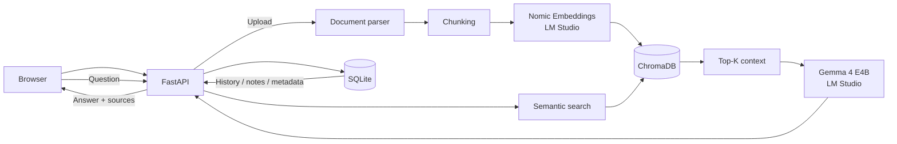

# AI Knowledge Assistant

Локальный **RAG-ассистент для работы с документами**. Приложение индексирует PDF/TXT/Markdown, строит embeddings, выполняет semantic search в ChromaDB и формирует ответ через локальную LLM в LM Studio. Ответ сопровождается источниками, а отдельный agent-mode умеет вызывать инструменты.

> Pet-project для портфолио Junior AI / LLM Developer (Python).

## Возможности

- загрузка нескольких PDF, TXT и Markdown-файлов;
- извлечение текста и chunking;
- embeddings через **Nomic Embed Text v1.5** в LM Studio;
- persistent vector database **ChromaDB**;
- semantic search + RAG;
- генерация ответа через **Gemma 4 E4B** по OpenAI-compatible API LM Studio;
- источники ответа: файл, страница, chunk и preview;
- история диалога в SQLite;
- tool/function calling;
- инструменты агента:
  - список индексированных документов;
  - сохранение заметки;
  - чтение сохранённых заметок;
- REST API на FastAPI;
- web UI;
- запуск локально или через Docker Compose.

## Стек

`Python 3.12` · `FastAPI` · `ChromaDB` · `SQLite` · `LM Studio` · `OpenAI-compatible API` · `RAG` · `Embeddings` · `Tool Calling` · `Docker`

## Архитектура



### RAG-пайплайн

1. Документ загружается через FastAPI.
2. Текст извлекается и разбивается на chunks.
3. Для chunks создаются embeddings через локальную embedding-модель в LM Studio.
4. Векторы и metadata сохраняются в ChromaDB.
5. Для вопроса создаётся query embedding.
6. ChromaDB возвращает наиболее релевантные chunks.
7. Найденный контекст передаётся LLM вместе с вопросом.
8. Пользователь получает ответ и список использованных источников.

## Структура проекта

```text
ai_knowledge_assistant/
├── app/
│   ├── main.py                 # FastAPI endpoints
│   ├── config.py               # settings / environment
│   ├── db.py                   # SQLite
│   ├── schemas.py              # Pydantic schemas
│   ├── services/
│   │   ├── chunking.py
│   │   ├── document_service.py
│   │   ├── vector_store.py     # embeddings + ChromaDB
│   │   ├── rag.py              # retrieval pipeline
│   │   └── llm.py              # LLM + tool calling
│   └── static/                 # web UI
├── data/                       # local persistent data (gitignored)
├── tests/
├── .env.example
├── .dockerignore
├── .gitignore
├── Dockerfile
├── docker-compose.yml
├── requirements.txt
└── start.bat
```

## Требования

- Python 3.11/3.12 — для локального запуска;
- LM Studio;
- chat/instruct-модель с поддержкой tool calling;
- embedding-модель;
- Docker Desktop — только для Docker-запуска.

Проверенная конфигурация проекта:

- Chat model: `google/gemma-4-e4b`
- Embedding model: `text-embedding-nomic-embed-text-v1.5`
- LM Studio API: `http://127.0.0.1:1234`

## Запуск LM Studio

1. Загрузите chat-модель `google/gemma-4-e4b`.
2. Загрузите `Nomic Embed Text v1.5`.
3. Откройте **Developer → Local Server**.
4. Запустите сервер.

Для локального запуска приложение обращается к:

```text
http://localhost:1234/v1
```

## Быстрый запуск на Windows

Самый простой способ:

```text
start.bat
```

Скрипт создаст virtual environment, установит зависимости и запустит Uvicorn.

Ручной вариант:

```powershell
py -m venv .venv
.\.venv\Scripts\Activate.ps1
pip install -r requirements.txt
copy .env.example .env
python -m uvicorn app.main:app --reload --host 127.0.0.1 --port 8000
```

После запуска:

- UI: `http://127.0.0.1:8000`
- Swagger: `http://127.0.0.1:8000/docs`

## Запуск через Docker

LM Studio должен быть запущен на Windows-хосте.

```powershell
docker compose up --build
```

В Docker приложение использует:

```text
http://host.docker.internal:1234/v1
```

После сборки откройте:

```text
http://127.0.0.1:8000
```

Данные ChromaDB, SQLite и загруженные документы сохраняются в `./data` через volume.

## Проверка RAG

1. Загрузите документ.
2. Задайте вопрос, ответ на который содержится в документе.
3. Проверьте ответ и список источников.
4. Задайте вопрос, информации о котором в документе нет — модель должна сообщить о недостатке данных, а не придумывать ответ.

Пример:

```text
Какие технологии упоминаются в документе для Junior AI / LLM Developer?
```

## Tool / Function Calling

Agent-mode передаёт модели набор доступных функций. Модель сама решает, когда вызвать инструмент, приложение выполняет функцию и возвращает результат модели.

Примеры запросов:

```text
Какие документы сейчас загружены?
```

```text
Сохрани заметку: основной карьерный фокус — Junior AI / LLM Developer на Python.
```

```text
Покажи мои сохранённые заметки.
```

## API

| Method | Endpoint | Назначение |
|---|---|---|
| `GET` | `/api/health` | состояние приложения |
| `GET` | `/api/documents` | список индексированных документов |
| `POST` | `/api/documents/upload` | загрузка и индексация документов |
| `POST` | `/api/ask` | RAG-вопрос |
| `GET` | `/api/conversations/{id}` | история диалога |
| `GET` | `/api/notes` | сохранённые заметки |
| `POST` | `/api/agent` | agent-mode с tool calling |

## Конфигурация

Основные переменные `.env`:

```env
LM_STUDIO_BASE_URL=http://localhost:1234/v1
LM_STUDIO_API_KEY=lm-studio
LM_STUDIO_MODEL=google/gemma-4-e4b
EMBEDDING_MODEL=text-embedding-nomic-embed-text-v1.5
CHROMA_COLLECTION=knowledge_base
MAX_CONTEXT_CHUNKS=3
MIN_RELEVANCE=0.15
```

Секреты и `.env` не коммитятся в Git.

## Тесты

Установка dev-зависимостей:

```powershell
pip install -r requirements-dev.txt
```

Запуск:

```powershell
pytest
```

## Статус

**Working portfolio project / v1.0**

Проверены вручную: загрузка документов, RAG-ответы с источниками, локальные embeddings, tool calling и Docker-сборка приложения.
